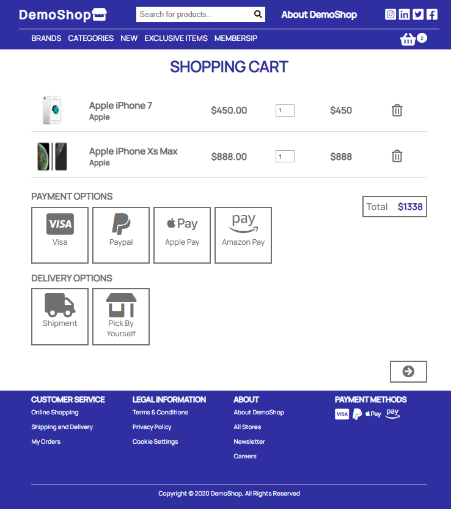

# Online Shop products list and cart

Simulation of online shop. Users can sort list of products, add them to cart, change their
quantity and delete them.

## Frontend

- JavaScript
- HTML5
- CSS3

Cart Items are stored in browser local storage.

## Backend

- Python
- Django
- Django Rest Framework

Simple Rest Api which includes only GET method.

## Demo

